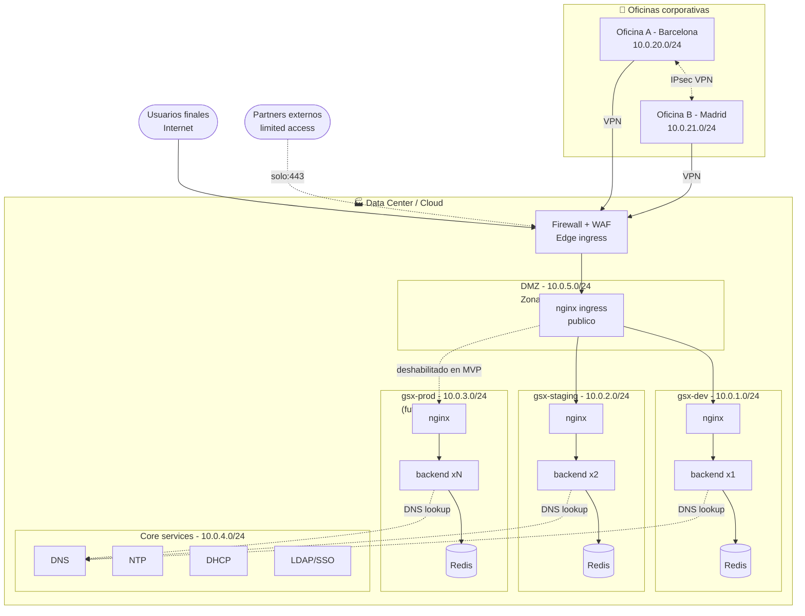

# Week 12: Network Design & Identity

GreenDevCorp ha pasado de 4 a 20+ personas en dos oficinas, hay partners externos y tres entornos (dev/staging/prod). Esta semana diseñamos la red corporativa, segmentamos el cluster con NetworkPolicies de Kubernetes y razonamos sobre cómo gestionar identidad de forma centralizada.

---

## 1. Arquitectura de red



**Decisiones clave:**

- **Tres entornos aislados** en namespaces independientes (`gsx-dev`, `gsx-staging`, `gsx-prod`). Un fallo en dev no afecta a producción ni siquiera a nivel de red.
- **DMZ separada del internal**. El nginx público vive en su zona; los backends y bases de datos no son alcanzables directamente desde fuera.
- **Servicios core (DNS/DHCP/NTP/LDAP)** en su propia subred porque los consumen TODOS los entornos: aislarlos evita que un fallo de DNS deje sin nombre a producción mientras dev sigue vivo (y al revés).
- **Partners** tienen un segmento dedicado (10.0.10.0/24) y solo acceden por HTTPS/443 al firewall: no entran en el cluster directamente.
- **Oficinas conectadas por VPN IPsec site-to-site** (ver §6).

---

## 2. Plan de direccionamiento (CIDR)

Espacio total: **`10.0.0.0/16`** (65 534 IPs útiles, sobrado para 100+ personas).

| Subred | Tamaño | Hosts | Uso |
|---|---|---|---|
| `10.0.0.0/24` | /24 | 254 | Management (jump hosts, ansible-controller) |
| `10.0.1.0/24` | /24 | 254 | gsx-dev |
| `10.0.2.0/24` | /24 | 254 | gsx-staging |
| `10.0.3.0/24` | /24 | 254 | gsx-prod (reservada) |
| `10.0.4.0/24` | /24 | 254 | Core services (DNS, DHCP, NTP, LDAP) |
| `10.0.5.0/24` | /24 | 254 | DMZ (servicios públicos) |
| `10.0.10.0/24` | /24 | 254 | Partners externos |
| `10.0.20.0/24` | /24 | 254 | Oficina A (Barcelona) |
| `10.0.21.0/24` | /24 | 254 | Oficina B (Madrid) |
| `10.0.99.0/24` | /24 | 254 | VPN client pool |

**Por qué `/24` y no algo más fino?** 254 hosts cubre con holgura el headcount actual y crecimiento previsto. Mantener un único tamaño de subred simplifica enormemente las reglas de firewall y la lectura mental del diagrama. Un eventual crecimiento se puede absorber con `/22` agregándolas (`10.0.16.0/22` para una nueva sede grande, por ejemplo).

**Por qué 10.0.0.0/16 y no 192.168.x.x?** RFC 1918 permite ambos, pero `10.0.0.0/16` evita choques con las redes de los routers domésticos (`192.168.0.0/24` y `192.168.1.0/24`) cuando alguien hace VPN desde su casa.

---

## 3. Segmentación lógica (defense-in-depth)

Dentro de cada entorno aplicamos el patrón clásico de tres capas:

| Capa | Pods | Quién puede entrar | Quién puede salir |
|---|---|---|---|
| **Frontend / DMZ** | `nginx` | Internet (8080) | Solo backend (3000) |
| **Application / Internal** | `backend` | Solo nginx (3000) | Solo redis (6379) + DNS |
| **Data** | `redis` | Solo backend (6379) | Solo DNS |

Cada capa tiene reglas de ingress y egress mínimas (principio de **menor privilegio**). Si un atacante compromete el contenedor de backend, no puede hablar con redis de OTRO entorno, ni salir a Internet, ni siquiera reiniciar pods (eso depende del RBAC, fuera del scope).

---

## 4. NetworkPolicies de Kubernetes (implementación)

Las políticas viven en [`week_12/networkpolicies/`](../week_12/networkpolicies/) y se aplican a `gsx-dev` y `gsx-staging` con `bash deploy_week12.sh`.

### Modelo: default-deny + allows explícitos

```
                                   ┌──────────────────┐
   Internet (NodePort) ────────────▶│  nginx (8080)    │ ← (allow ingress 8080 abierto)
                                   └────────┬─────────┘
                                            │ allow egress :3000
                                            ▼
                                   ┌──────────────────┐
                                   │ backend (3000)   │ ← solo from app=nginx
                                   └────────┬─────────┘
                                            │ allow egress :6379
                                            ▼
                                   ┌──────────────────┐
                                   │ redis (6379)     │ ← solo from app=backend
                                   └──────────────────┘

   ✗ Cualquier otra cosa: bloqueada por default-deny
```

| Archivo | Qué hace |
|---|---|
| `00-default-deny.yaml` | `podSelector: {}` con `policyTypes: [Ingress, Egress]` y SIN reglas → niega todo |
| `01-allow-dns-egress.yaml` | Permite UDP/TCP 53 hacia kube-dns (sin esto los pods no pueden resolver `backend`) |
| `02-nginx-policies.yaml` | Ingress :8080 desde cualquier sitio + egress hacia `app=backend:3000` |
| `03-backend-policies.yaml` | Ingress :3000 desde `app=nginx` + egress hacia `app=redis:6379` |
| `04-redis-policies.yaml` | Ingress :6379 desde `app=backend`. Sin política de egress → no sale a ningún sitio |
| `05-partners-cidr-restricted.yaml` | **(Intermediate)** Ejemplo con `ipBlock` + `except` + multiples CIDRs. NO aplicado por defecto, ver §6 |

### Aislamiento entre entornos (cross-env)

No hace falta una política explícita de "deny gsx-dev → gsx-staging". Las allows solo usan `podSelector` (sin `namespaceSelector`), y `podSelector` por defecto significa **mismo namespace**. Como el default-deny de cada entorno corta todo lo demás, el cross-env queda bloqueado por construcción.

Esto se valida en `verify_week12.sh` con un test que intenta `nc backend.gsx-staging.svc.cluster.local 3000` desde un pod de gsx-dev: debe fallar.

### Caveat: el CNI

Minikube por defecto usa **kindnet**, que **acepta NetworkPolicies como objetos pero NO las aplica**. Para tener enforcement real hay que arrancar el cluster con un CNI compatible:

```bash
minikube delete
minikube start --cni=calico --driver=docker
```

Calico es el estándar de facto. `deploy_week12.sh` detecta si Calico/Cilium están corriendo y avisa si no.

---

## 5. Reglas avanzadas (Intermediate)

### Restricción por CIDR + ipBlock + except

Para producción no querríamos que **cualquiera** pueda hablar con nginx por NodePort. Sustituiríamos la regla abierta por una basada en CIDR. El archivo [`05-partners-cidr-restricted.yaml`](../week_12/networkpolicies/05-partners-cidr-restricted.yaml) muestra la sintaxis:

```yaml
ingress:
  - from:
      - ipBlock: { cidr: 10.0.20.0/24 }      # Oficina A
      - ipBlock: { cidr: 10.0.21.0/24 }      # Oficina B
      - ipBlock:
          cidr: 10.0.10.0/24                 # Partners
          except:
            - 10.0.10.99/32                  # IP comprometida bloqueada
    ports:
      - { protocol: TCP, port: 8080 }
```

No la aplicamos en el deploy porque es **aditiva** con la regla abierta de `02-nginx-policies.yaml`: convivir las dos no restringe nada (Kubernetes une los allows). Para activarla en serio: comentar el ingress abierto de `02-nginx-policies.yaml` y desplegar `05`.

### Exposición a partners

Para servicios que partners externos necesitan consumir (p.ej. una API pública de catálogo):

1. **Endpoint dedicado** detrás del firewall: subdominio `partners.greendevcorp.com` con su propia regla DNS y certificado TLS.
2. **Mutual TLS (mTLS)**: el partner presenta certificado de cliente firmado por nuestra CA interna. Sin certificado → el firewall corta antes de tocar el cluster.
3. **NetworkPolicy** que solo deja el segmento `10.0.10.0/24` → puerto 8443 del nginx-partners (un nginx distinto del público).
4. **Rate limiting + WAF** delante (envío excesivo bloqueado, OWASP Top 10 mitigado).
5. **Auditoría**: cada request del partner se loga con su CN del certificado, para responder a "¿quién accedió a qué?" en compliance.

---

## 6. VPN entre oficinas (Intermediate)

Las dos oficinas tienen que poder verse como si estuvieran en la misma LAN, sin exponer tráfico a Internet en claro. Diseño:

```
  Oficina A (Barcelona)              Oficina B (Madrid)
  10.0.20.0/24                       10.0.21.0/24
  ┌────────────┐                     ┌────────────┐
  │ Router/FW  │═══ IPsec tunnel ═══│ Router/FW  │
  │ + IPsec    │   (IKEv2 + AES-256) │ + IPsec    │
  └─────┬──────┘                     └─────┬──────┘
        │                                  │
   workstations                       workstations
   10.0.20.10-254                     10.0.21.10-254
```

**Tecnología: IPsec site-to-site (IKEv2 con AES-256-GCM + SHA-256).** Razones:
- **Soportado nativamente** por todos los routers/firewalls de gama profesional (Cisco ASA, Fortinet, pfSense, OPNsense). Cero coste de licencia.
- **Interoperable** entre vendors. Si mañana cambiamos el router de Madrid, el de Barcelona sigue funcionando.
- **Cifrado end-to-end** del tráfico inter-oficina. Aunque pase por la red de un ISP, va opaco.
- **Routing transparente**: con OSPF/BGP sobre IPsec, los hosts de Madrid pueden hablar con los de Barcelona usando IPs reales sin saber que hay tunnel en medio.

**Alternativas consideradas:**

| Opción | Pro | Contra | Decisión |
|---|---|---|---|
| WireGuard | Más rápido, más simple | No soporta routing dinámico nativo, ecosistema empresarial menor | Buena para road-warriors (clientes VPN), no para site-to-site core |
| OpenVPN | Muy soportado, TCP fallback | Más overhead que IPsec; performance peor | Descartado |
| MPLS dedicado | Latencia mínima, SLA del proveedor | 10× más caro y bloquea al proveedor | Solo si el negocio lo necesita por SLA |

**Acceso de empleados remotos**: además del túnel site-to-site, los devs trabajando desde casa se conectan al pool VPN `10.0.99.0/24` mediante WireGuard, autenticándose contra el LDAP corporativo (ver §9).

---

## 7. Servicios core: DNS, DHCP, NTP

### DNS (Domain Name System)

DNS traduce nombres legibles (`backend.gsx-dev.svc.cluster.local`, `git.greendevcorp.com`) en direcciones IP. Sin él, escribiríamos IPs a mano y al cambiar un servicio de máquina romperíamos todo lo que la consume. Funciona como una jerarquía: el cliente pregunta a un resolver, el resolver pregunta a los servidores autoritativos del dominio (`.com` → `greendevcorp.com` → `git.greendevcorp.com`) y devuelve la IP, cacheándola con un TTL.

En GreenDevCorp tendremos un **DNS interno** (CoreDNS o BIND) que resuelve `*.greendevcorp.local` y reenvía el resto a los DNS públicos de Cloudflare (1.1.1.1) y Google (8.8.8.8) como fallback. Dentro del cluster, **kube-dns/CoreDNS** resuelve los nombres de servicios K8s automáticamente.

### DHCP (Dynamic Host Configuration Protocol)

DHCP automatiza la asignación de IPs y configuración de red (gateway, DNS, máscara) a cualquier dispositivo que se conecta a la red. Sin DHCP, cada laptop nueva habría que configurarla a mano y mantener una hoja de cálculo de IPs que nadie actualizará. El cliente arranca, lanza un broadcast `DHCPDISCOVER`, el servidor responde `DHCPOFFER` con una IP del pool, el cliente la acepta con `DHCPREQUEST`, el servidor confirma con `DHCPACK`. La asignación es por *lease* con expiración (típico 24h-7d).

En GreenDevCorp habrá un servidor DHCP por subred de oficina (`10.0.20.0/24` y `10.0.21.0/24`) con leases de 7 días para workstations y reservas estáticas para impresoras, switches y APs WiFi.

### NTP (Network Time Protocol)

NTP sincroniza el reloj de todas las máquinas con servidores de tiempo precisos (en última instancia, relojes atómicos). Importa por dos razones críticas: **seguridad** (TLS, Kerberos y los certificados firmados rechazan timestamps desfasados; un reloj 10 minutos atrás puede invalidar tu sesión SSH o aceptar un certificado expirado), y **forensics/logs** (correlacionar un fallo entre servidor A y servidor B requiere que sus timestamps coincidan; si difieren 5 segundos, la línea de tiempo del incidente es inutilizable).

GreenDevCorp tendrá dos servidores NTP internos sincronizados con el pool público (`pool.ntp.org`) y sirviéndose como fuente al resto de la infra. Stratum 2-3 es suficiente para servicios IT no críticos.

---

## 8. Identidad: autenticación vs autorización

Son cosas distintas y se confunden continuamente:

- **Autenticación (authN)**: ¿quién eres? Verificar identidad mediante credenciales (contraseña, MFA, certificado, biometría). Resultado: "sí, eres Pau Planas con email pau@greendevcorp.com".
- **Autorización (authZ)**: ¿qué puedes hacer? Decidir si el usuario autenticado tiene permiso para una acción concreta. Resultado: "Pau puede leer el bucket S3 `dev-data` pero NO el `prod-data`".

La frontera es sutil: el SSO te autentica una vez y luego cada servicio decide la autorización con esa identidad. Confundirlas lleva a fallos clásicos como dar acceso total a alguien autenticado, o pedir contraseña en cada servicio aunque ya se hubiera hecho login.

### LDAP, Active Directory y SSO

**LDAP (Lightweight Directory Access Protocol)** es el protocolo estándar (desde 1993) para consultar y modificar un directorio jerárquico de usuarios, grupos, contraseñas y atributos. Una entrada LDAP típica: `cn=pau,ou=devops,dc=greendevcorp,dc=local` con campos `mail`, `memberOf`, `userPassword` (hasheada). Lo usan miles de aplicaciones para autenticación.

**Active Directory** es la implementación de Microsoft de un directorio LDAP + Kerberos + DNS + GPO + servicios de dominio. Es de facto el estándar en empresas con Windows. Soporta el protocolo LDAP, así que aplicaciones Linux pueden integrarse contra AD igual que contra OpenLDAP.

**SSO (Single Sign-On)** es un patrón, no un protocolo: el usuario hace login UNA VEZ contra un proveedor de identidad (IdP), y los servicios consumidores aceptan un token firmado por el IdP en lugar de pedir credenciales propias. Las implementaciones modernas usan **SAML 2.0** (corporativo, XML, lo entienden Salesforce/Workday) u **OIDC sobre OAuth 2.0** (web, JSON, lo entienden GitHub/Slack/Notion). Beneficios: el usuario tiene una sola contraseña que recordar, IT solo gestiona usuarios en un sitio, y al despedir a alguien basta desactivar la cuenta en el IdP para revocar acceso a TODO.

---

## 9. Recomendación de identity strategy para GreenDevCorp

**Contexto**: 20+ empleados en dos oficinas, planes de crecer a 100. Stack técnico mixto (laptops Mac/Linux/Windows, servicios SaaS, Kubernetes en cloud, GitHub).

**Recomendación: Google Workspace + OIDC como IdP central, complementado con OpenLDAP para el dominio Linux interno.**

### Por qué

1. **Google Workspace** (~6 €/usuario/mes en plan Business Starter) ya cubre el correo corporativo y Drive. Activando "Single Sign-On" en sus apps, la cuenta de Google se convierte en el IdP de OIDC de toda la compañía. Sin desplegar nada propio.

2. **OIDC** está soportado por GitHub Enterprise, Slack, Notion, AWS, GCP, Datadog, PagerDuty, y prácticamente cualquier SaaS moderno. Configurar SSO en cada uno es un formulario.

3. **Onboarding/offboarding en un solo lugar**: alta de un nuevo empleado = crear cuenta Google + asignar grupo. Baja = desactivar cuenta Google → en cuestión de minutos pierde acceso a TODO. Cumplir compliance se vuelve trivial.

4. **MFA gratis incluido** vía Google Authenticator / hardware keys (FIDO2). Sin MFA cualquier compromiso de contraseña es game over.

5. **Para servicios Linux internos** (acceso SSH a servidores, Kubernetes, etc.) montamos un **OpenLDAP** sincronizado con Google Workspace via [Google Cloud Directory Sync](https://support.google.com/a/answer/106368) (gratuito). Así los servidores Linux autentican contra LDAP y los usuarios siguen usando la misma contraseña Google.

### Trade-offs

| Aspecto | Ventaja | Inconveniente |
|---|---|---|
| Coste | ~6 €/usuario × 20 = 120 €/mes; barato | Crece linealmente; a 200 empleados son 1200 €/mes |
| Soberanía | Sin servidores propios que mantener | Dependes de Google: si caen ellos, caes tú |
| Vendor lock-in | Migrar fuera = exportar usuarios + reconfigurar SAML/OIDC en cada SaaS | Dolor de uno o dos sprints |
| Compliance | Google está certificado SOC 2, ISO 27001, GDPR | El hosting es en USA: revisar si hay clientes europeos críticos |

### Por qué NO Active Directory en este momento

AD es excelente pero requiere un dominio Windows Server, GPO, DNS interno bien afinado, y un sysadmin que sepa de PowerShell. Para 20 personas con flota mixta Linux/Mac es overkill. A 200+ empleados con muchos Windows, sí re-evaluaríamos AD on-prem o **Microsoft Entra ID** (la versión cloud).

### Por qué NO OpenLDAP solo

Funciona técnicamente, pero implica self-hosting de un servidor crítico, certificados TLS propios, replicación master-slave, integraciones SAML/OIDC custom para cada SaaS. Mucho trabajo de mantenimiento que no aporta ventaja competitiva al negocio.

---

## 10. Análisis de seguridad: qué puede salir mal

| Riesgo | Mitigación |
|---|---|
| **Pod malicioso roba el token de service account** y habla con la API de K8s | RBAC mínimo por SA + NetworkPolicy bloqueando egress a `kubernetes.default` salvo donde haga falta + auditoría kube-apiserver |
| **Backend comprometido intenta acceder a Redis de prod** | Cross-env bloqueado por default-deny + same-ns selectors. Verificado en `verify_week12.sh` |
| **Container con vulnerabilidad llama a C2 en Internet** | Egress bloqueado salvo DNS interno + servicios mismo ns. Sin internet egress, el malware no puede comunicarse con su atacante |
| **Reuse de password tras leak en otro servicio** | MFA obligatoria via Google Workspace. Sin segundo factor el atacante no entra |
| **Exempleado mantiene acceso a GitHub / AWS** | SSO centralizado: desactivar cuenta Google revoca todo en cuestión de minutos |
| **Partner hace request abusiva (DoS o injection)** | WAF + rate limiting en el firewall + mTLS con certificado revocable |
| **NetworkPolicy mal configurada bloquea producción** | `verify_week12.sh` corre tests positivos y negativos en CI. Nunca aplicamos políticas a prod sin pasar antes por staging |
| **Cluster Minikube con kindnet → políticas ignoradas silenciosamente** | `deploy_week12.sh` detecta el CNI y avisa antes de aplicar. En cloud usamos GKE/EKS con Calico de fábrica |
| **DNS interno cae** | Dos servidores en activo-activo + fallback a DNS público para resolución externa |

---

## 11. Cómo desplegar y verificar

```bash
# Pre-requisito: cluster con CNI que aplique NetworkPolicies (Calico)
minikube delete
minikube start --cni=calico --driver=docker

# Re-desplegar la semana 11 (los namespaces gsx-dev y gsx-staging)
cd ~/scripting_gsx_2/week_11
bash local_cd.sh dev <sha>
bash local_cd.sh staging <sha>

# Aplicar las NetworkPolicies de la semana 12
cd ~/scripting_gsx_2/week_12
bash deploy_week12.sh

# Verificar que las políticas hacen lo que tienen que hacer
bash verify_week12.sh dev
bash verify_week12.sh staging
```

`verify_week12.sh` ejecuta 6 tests por entorno: 3 de "deberia pasar" (positivos) y 3 de "deberia bloquear" (negativos). Una política bien implementada → los 6 marcan PASS.

---

## 12. Para la entrevista oral

Preguntas probables y respuestas cortas:

| Pregunta | Respuesta |
|---|---|
| ¿Por qué segmentar? | Limita el blast radius: un compromiso en dev no toca prod ni la base de datos |
| ¿Qué es CIDR? | Notación para representar rangos de IPs con un prefijo de longitud variable. `/24` = 256 IPs, `/16` = 65k IPs |
| ¿Por qué NetworkPolicies y no firewalls de host? | Las políticas viajan con el pod: si se mueve de nodo, las reglas siguen aplicándose. Un firewall de host depende de que el pod esté en ese host |
| ¿Qué pasa si Minikube usa kindnet? | Las políticas se aceptan pero no se aplican: alta exposición silenciosa. Por eso usamos Calico |
| ¿AuthN vs AuthZ? | "Quién eres" vs "qué puedes hacer". Authz solo tiene sentido tras una authn satisfactoria |
| ¿Por qué SSO en una empresa pequeña? | Onboarding/offboarding en un sitio + MFA central + auditoría compliance en un sitio. Vale la inversión desde el día uno |
| ¿Por qué IPsec y no WireGuard para site-to-site? | IPsec es estándar en routers empresariales y soporta routing dinámico. WireGuard es mejor para clientes individuales |
