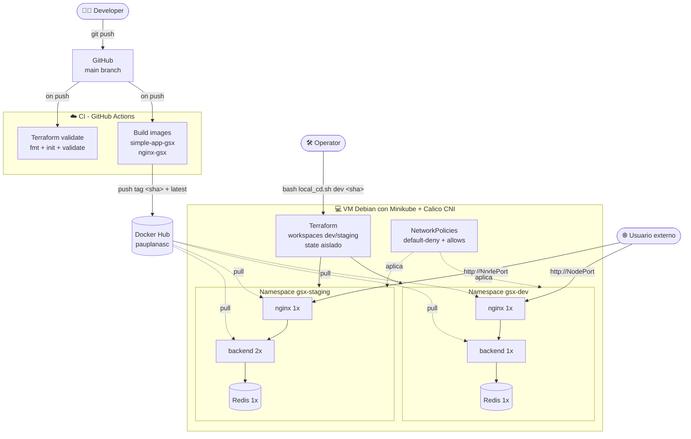

# Week 13: Integration, Observability & Finalization

Documento de cierre de la Práctica 2. Integra todo lo construido en semanas 8-12, describe la operación del sistema y sirve de manual para alguien nuevo (o para nosotros mismos en 6 meses).

---

## 1. Visión global de la infraestructura



**Flujo de un cambio (end-to-end):**

1. **Dev** modifica `week_9/backend/server.js` y hace `git push`.
2. **CI** detecta el push, construye `pauplanasc/simple-app-gsx:<sha>` y la sube a Docker Hub. Valida `main.tf`.
3. **Operator** (o el dev) entra a la VM y ejecuta `bash local_cd.sh dev <sha>`.
4. Terraform detecta que la imagen del Deployment ha cambiado y hace un rolling update sin downtime.
5. Pruebas en dev → si pasan, repetir en staging con el MISMO `<sha>` (promoción inmutable).

---

## 2. Componentes del sistema

| Componente | Imagen / Recurso | Función | Dependencias |
|---|---|---|---|
| **nginx** | `pauplanasc/nginx-gsx:<tag>` | Reverse proxy: recibe tráfico externo en :8080, lo enruta a `backend:3000` | backend |
| **backend** | `pauplanasc/simple-app-gsx:<tag>` (Node.js) | Sirve "/", incrementa contador en Redis, devuelve mensaje + visitante | redis (config vía ConfigMap) |
| **redis** | `redis:7-alpine` | Almacena el contador de visitas. Único stateful. | - |
| **ConfigMap `app-config`** | nativo K8s | Inyecta APP_MESSAGE, PORT, REDIS_HOST en backend | - |
| **Service `nginx-service`** | NodePort | Expone nginx fuera del cluster (Minikube IP : NodePort) | - |
| **Service `backend`** | ClusterIP | DNS interno para que nginx llegue al backend | - |
| **Service `redis`** | ClusterIP | DNS interno para que backend llegue a redis | - |
| **NetworkPolicies (7)** | nativo K8s + Calico | Default-deny + allows mínimos por capa | Calico CNI |

**Configuración por entorno** ([`week_11/terraform/environments/`](../week_11/terraform/environments/)):

| Var | dev | staging |
|---|---|---|
| `replica_count` | 1 | 2 |
| `app_message` | `🛠️ Entorno de DESARROLLO (Inestable)` | `✅ Entorno de STAGING (Copia exacta de Prod)` |
| Namespace | `gsx-dev` | `gsx-staging` |

---

## 3. Runbook operacional

Manual para el ingeniero de guardia. Cada acción tiene comando exacto.

### 3.1 Deployar una nueva versión

**Pre-requisito**: la CI del commit a desplegar tiene que estar verde (https://github.com/pauplanasc/scripting_gsx_2/actions).

```bash
# 1. Obtener el SHA corto del commit
SHA=$(git rev-parse --short HEAD)        # desde la VM, dentro del repo

# 2. Promocionar a dev
cd ~/scripting_gsx_2/week_11
bash local_cd.sh dev $SHA

# 3. Validar
bash verify_week11.sh dev $SHA
# Esperar 6 ✅

# 4. Si dev OK, promocionar a staging con el MISMO SHA
bash local_cd.sh staging $SHA
bash verify_week11.sh staging $SHA
```

**Nunca** desplegar a staging un SHA que no haya pasado en dev.

### 3.2 Escalar un servicio

**Vía Terraform (forma correcta, persiste):**

```bash
# Editar week_11/terraform/environments/staging.tfvars
replica_count = 4   # de 2 a 4

# Aplicar
cd ~/scripting_gsx_2/week_11
bash local_cd.sh staging $SHA
```

**Hot-fix temporal (NO recomendado, no persiste, Terraform lo revertirá al siguiente apply):**

```bash
kubectl scale deployment backend -n gsx-staging --replicas=4
```

### 3.3 Ver logs de un servicio

```bash
# Logs vivos del backend en dev
kubectl logs -n gsx-dev -l app=backend -f --tail=100

# Logs de un pod específico
kubectl logs -n gsx-dev <pod-name>

# Logs de todos los pods de una app, agregados
kubectl logs -n gsx-dev -l app=backend --all-containers --prefix
```

### 3.4 Hacer rollback a la versión anterior

```bash
# Opción A: via Terraform (forma correcta)
bash local_cd.sh dev <SHA-anterior>

# Opción B: via kubectl (más rápido pero no actualiza estado de Terraform)
kubectl rollout undo deployment/backend -n gsx-dev
```

Después de un rollback con `kubectl`, hay que sincronizar Terraform editando el image tag y haciendo apply, o el siguiente `terraform plan` mostrará drift.

### 3.5 Acceder al servicio (smoke test rápido)

```bash
MIP=$(minikube ip)
PORT_DEV=$(kubectl get svc nginx-service -n gsx-dev -o jsonpath='{.spec.ports[0].nodePort}')
PORT_STG=$(kubectl get svc nginx-service -n gsx-staging -o jsonpath='{.spec.ports[0].nodePort}')
echo "dev:     http://$MIP:$PORT_DEV"
echo "staging: http://$MIP:$PORT_STG"

curl -s "http://$MIP:$PORT_DEV"
curl -s "http://$MIP:$PORT_STG"
```

### 3.6 Reiniciar un pod (sin tocar manifests)

```bash
kubectl rollout restart deployment/backend -n gsx-dev
```

### 3.7 Recrear la infra entera desde cero

Útil para validar que todo es reproducible (esto es el Challenge B):

```bash
cd ~/scripting_gsx_2/week_13
bash integration_test.sh 4d169be
```

---

## 4. Troubleshooting

Problemas comunes y cómo diagnosticarlos.

### 4.1 "El servicio no responde"

**Síntoma**: `curl http://<minikube-ip>:<port>` se queda colgado o devuelve "Connection refused".

**Diagnóstico paso a paso:**

```bash
# 1. ¿Existe el namespace?
kubectl get ns | grep gsx-

# 2. ¿Hay pods Running?
kubectl get pods -n gsx-dev
# Si están en Error/CrashLoopBackOff → revisa logs (4.2)
# Si están en Pending → falta CPU/RAM, ver 4.3

# 3. ¿El Service está bien?
kubectl get svc -n gsx-dev nginx-service
kubectl describe svc -n gsx-dev nginx-service
# Mira "Endpoints": si está vacío, el selector no encuentra pods

# 4. ¿El NetworkPolicy bloquea?
kubectl get networkpolicy -n gsx-dev
# Si la respuesta era "OK antes de aplicar políticas y ahora no", probablemente
# es la regla 02-nginx-policies.yaml. Comprueba con:
bash ~/scripting_gsx_2/week_12/verify_week12.sh dev
```

### 4.2 "El pod entra en CrashLoopBackOff"

```bash
# Ver el último error
kubectl logs -n gsx-dev <pod> --previous

# Ver eventos del pod (descripciones de fallos del scheduler/kubelet)
kubectl describe pod -n gsx-dev <pod> | tail -30

# Causas más comunes en este sistema:
#   - Imagen no existe en Docker Hub (ImagePullBackOff): comprueba CI verde.
#   - Backend no resuelve "redis": NetworkPolicy DNS rota o servicio redis caído.
#   - OOMKilled: revisa requests/limits en main.tf.
```

### 4.3 "Pods en Pending durante minutos"

**Causa típica**: scheduler no encuentra un nodo con recursos disponibles.

```bash
kubectl describe pod -n gsx-dev <pod-pending>
# Mira la sección "Events" al final. Texto típico:
#   "0/1 nodes are available: 1 Insufficient memory"

# Solución corta: bajar limits en main.tf y re-aplicar
# Solución larga: arrancar Minikube con más RAM
minikube delete && minikube start --cni=calico --memory=4096
```

### 4.4 "El curl al endpoint devuelve 'Error conectando a la base de datos'"

Significa que el backend arrancó pero no consigue hablar con Redis. Diagnosis:

```bash
# 1. ¿Redis está vivo?
kubectl get pod -n gsx-dev -l app=redis

# 2. ¿El backend resuelve "redis" por DNS?
kubectl exec -n gsx-dev -l app=backend -- wget -q -T 3 -O- http://redis:6379 || echo "DNS o conectividad falla"

# 3. ¿Algún NetworkPolicy bloqueando?
kubectl describe networkpolicy -n gsx-dev backend-egress-to-redis
# Busca "Allowing egress traffic" en la salida de describe
```

### 4.5 "Terraform dice 'objects have changed outside of Terraform'"

Algo (otro miembro del equipo, kubectl manual, o reinicio de Minikube) modificó el cluster sin pasar por Terraform. **Acción**:

```bash
cd ~/scripting_gsx_2/week_11/terraform
terraform workspace select <env>
terraform plan -var-file=environments/<env>.tfvars -var=image_tag=<SHA>
# Lee el plan: si los cambios externos son legítimos (deployment Recreated después
# de minikube restart), un terraform apply los reconcilia.
# Si son ilegítimos (alguien cambio replicas a mano), el apply los revierte.
```

### 4.6 "GitHub Actions falla en el step 'Login to DockerHub'"

Significa que los secrets `DOCKERHUB_USERNAME` o `DOCKERHUB_TOKEN` no están configurados o son inválidos. Ir a:

`https://github.com/pauplanasc/scripting_gsx_2/settings/secrets/actions` y reconfigurar. El token de Docker Hub debe tener permiso *Read & Write*.

### 4.7 "minikube delete && start tarda 5+ minutos"

Es normal la primera vez con Calico (descarga las imágenes del CNI). Subsequente arranques son más rápidos. Para no recrear: `minikube stop` + `minikube start` conserva el estado.

### 4.8 "verify_week12.sh dice que las políticas bloquean cuando deberían permitir"

```bash
# Asegúrate de que el cluster usa Calico (kindnet IGNORA NetworkPolicies)
kubectl get pods -n kube-system | grep -E "calico|cilium"
# Si no salen → re-arranca minikube con --cni=calico (destructivo)
```

---

## 5. Cómo desplegar todo desde cero (quickstart)

Usuario nuevo, máquina virgen Debian 12 con Docker y kubectl ya instalados:

```bash
# 0. Clonar
git clone https://github.com/pauplanasc/scripting_gsx_2.git
cd scripting_gsx_2

# 1. Minikube con Calico (necesario para NetworkPolicies)
minikube start --cni=calico --driver=docker

# 2. Desplegar dev y staging
cd week_11
bash deploy_week11.sh dev latest      # incluye instalacion de terraform
bash local_cd.sh staging latest

# 3. Aplicar NetworkPolicies
cd ../week_12
bash deploy_week12.sh

# 4. Verificar todo
bash verify_week12.sh dev
bash verify_week12.sh staging

# 5. Smoke test
MIP=$(minikube ip)
DEV_PORT=$(kubectl get svc nginx-service -n gsx-dev -o jsonpath='{.spec.ports[0].nodePort}')
curl http://$MIP:$DEV_PORT
```

---

## 6. Decisiones de diseño y trade-offs (resumen)

| Decisión | Por qué | Alternativa | Por qué la rechazamos |
|---|---|---|---|
| **Terraform en lugar de Ansible** | Declarativo, mapeo 1-a-1 con K8s, idempotencia natural, plan antes de apply | Ansible | Procedural, peor para grafos de recursos K8s |
| **Workspaces de Terraform** | Estado aislado por entorno, dev y staging conviven en mismo código | `-state=...` por env | Más manual, propenso a errores |
| **Redis incluido en Terraform** | El backend lo necesita; sin él el contador no funciona | Redis externo (Upstash, ElastiCache) | Para el alcance docente, prefiero todo K8s |
| **CI build + push, CD local** | GitHub Actions no llega a Minikube; Promoción manual da control | CD remoto a un cluster cloud | Fuera de alcance + coste |
| **Minikube + Calico** | Local, gratis, con enforcement real de NetworkPolicies | kindnet por defecto | No aplica políticas (silencioso, peligroso) |
| **NetworkPolicies con default-deny** | Defense-in-depth: todo bloqueado salvo allows explícitos | Allow-all permisivo | Menos seguro, no enseña principio de menor privilegio |
| **NodePort en lugar de LoadBalancer** | Minikube lo soporta nativamente | LoadBalancer/Ingress | Requiere minikube tunnel o un controller adicional |
| **Tag SHA + `:latest`** | SHA inmutable para reproducibilidad, latest para conveniencia | Solo SHA | Latest es cómodo para pruebas rápidas |

---

## 7. Limitaciones conocidas

- **Single-node Minikube**: si el nodo cae, todo cae. En prod: cluster multi-nodo con anti-affinity rules.
- **Sin observabilidad real**: no hay Prometheus + Grafana (Challenge A opcional). Solo `kubectl logs`. En prod: stack de observabilidad completo.
- **Redis sin persistencia**: el contador desaparece al reiniciar redis. En prod: PVC con storage class adecuado o Redis externo gestionado.
- **NetworkPolicies estáticas**: no hay automatización para actualizarlas cuando se añaden servicios. En prod: políticas como Helm chart o operator.
- **Sin secrets management**: APP_MESSAGE va en ConfigMap (ok) pero si hubiera credenciales irían en Kubernetes Secrets o, mejor, Vault/AWS SSM.
- **CI no tiene scan de vulnerabilidades**: en intermediate no es required, pero `trivy image pauplanasc/simple-app-gsx:<sha>` antes del push sería un buen siguiente paso.
- **3 GB de RAM en la VM**: justo. Calico + 2 entornos cabe ajustado. Reiniciar Minikube a veces deja pods en estado Error que hay que matar a la fuerza.

---

## 8. Roadmap si tuviéramos más tiempo

1. **Observabilidad** (Challenge A): añadir Prometheus + Grafana al Terraform, dashboard con request rate, latencia, CPU/memory.
2. **Multi-cloud / Multi-cluster**: Terraform para crear el cluster en GKE/EKS además de Minikube.
3. **GitOps con ArgoCD**: Hoy hacemos CD manual desde la VM. Con ArgoCD, el cluster pull-ea cambios del repo automáticamente.
4. **Secrets gestionados**: integrar HashiCorp Vault o AWS SSM Parameter Store.
5. **Service mesh** (Istio o Linkerd): para mTLS automático entre servicios y observabilidad de red sin tocar código.
6. **Chaos engineering**: con LitmusChaos, lanzar fallos controlados (pod kill, network delay) en staging para validar resiliencia.
